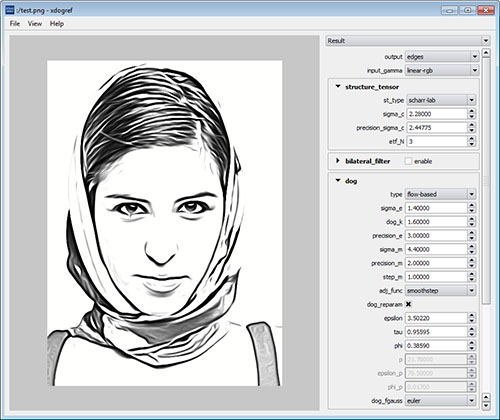

# xdog-demo

XDoG: An eXtended difference-of-Gaussians compendium iincluding advanced image stylization

Recent extensions to the standard Difference-of-Gaussians (DoG) edge detection operator have rendered it less susceptible to noise and increased its aesthetic appeal. Despite these advances, the technical subtleties and stylistic potential of the DoG operator are often overlooked. This paper offers a detailed review of the DoG operator and its extensions, highlighting useful relationships to other image processing techniques. It also presents many new results spanning a variety of styles, including pencil-shading, pastel, hatching, and woodcut. Additionally, we demonstrate a range of subtle artistic effects, such as ghosting, speed-lines, negative edges, indication, and abstraction, all of which are obtained using an extended DoG formulation, or slight modifications thereof. In all cases, the visual quality achieved by the extended DoG operator is comparable to or better than those of systems dedicated to a single style.

This program provides a reference implementation for the extended DoG operator. It was written by [Jan Eric Kyprianidis](http://www.kyprianidis.com/) while working as a research scientist for the [computer graphics systems group](http://www.hpi3d.de/) of the [Hasso-Plattner-Institut](http://www.hpi.uni-potsdam.de/) at the University of Potsdam, Germany.

Note: On Mac OS X the [NVIDIA Mac OS X CUDA driver](http://www.nvidia.com/object/mac-driver-archive.html) is required to run the binary!

## Building

Building requires [CMake](http://www.cmake.org/), [CUDA](http://developer.nvidia.com/cuda-toolkit), and the [Qt cross platform toolkit](http://qt-project.org). Recommended CUDA version is >= 4.0 and recommended Qt version is 4.8.2. The program has been tested to successfully build with Visual Studio 2008 SP1 on Windows, Qt Creator 2.5.0 on Mac OS X, and the default toolchain on Ubuntu 11.04. See build.bat/build.sh to get started. Video processing requires libav or FFmpeg, but is optional.

## Related Publications

* Winnemöller, H., Kyprianidis, J. E., & Olsen, S. C. (2012). [XDoG: An eXtended difference-of-Gaussians compendium including advanced image stylization](http://dx.doi.org/10.1016/j.cag.2012.03.004). Computers & Graphics, 36(6), pp. 740-753."
* Winnemöller, H. (2012). [XDoG: Advanced image stylization with eXtended Difference-of-Gaussians](http://dx.doi.org/10.1145/2024676.2024700). In: Proc. Symposium on Non-Photorealistic Animation and Rendering (NPAR), pp. 147-156.
* Kyprianidis, J. E. & Döllner, J. (2008). [Image abstraction by structure adaptive filtering](https://www.kyprianidis.com/p/tpcg2008/). In Proc. EG UK Theory and Practice of Computer Graphics, pp. 51–58.
* Winnemöller, H., Olsen, S. C., & Gooch, B. (2012). [Real-Time video abstraction](http://dx.doi.org/10.1145/1141911.1142018). ACM Transactions on Graphics, 25(3), pp. 1221-1226.
